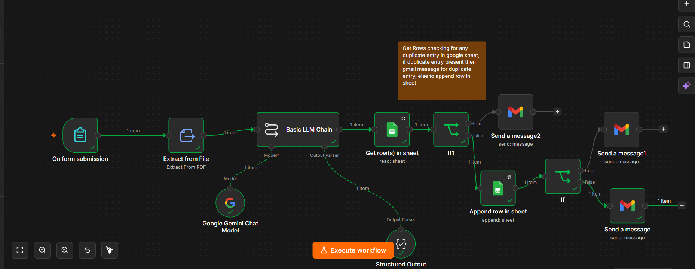
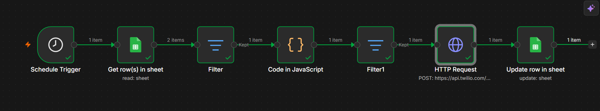
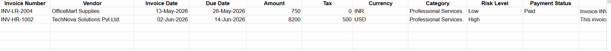
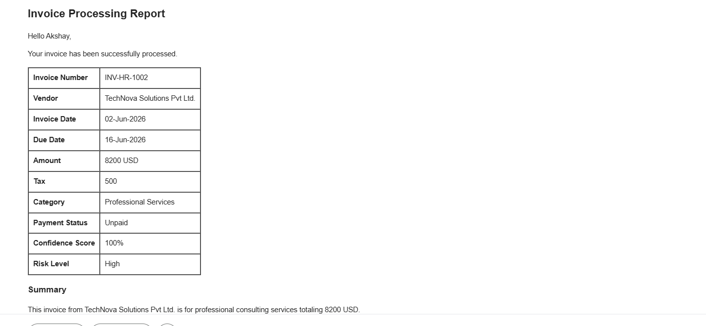

# AI Invoice Processing & WhatsApp Payment Reminder Automation

## 🚀 Overview

An end-to-end invoice management automation built with **n8n**, **OpenAI**, **Google Sheets**, and **WhatsApp Cloud API**.

This workflow automatically extracts invoice information, stores and tracks payment records, monitors due dates, and sends WhatsApp reminders to customers for outstanding payments.

The solution eliminates manual invoice tracking and follow-ups, helping businesses improve cash flow and reduce administrative effort.

---

## 🎯 Problem Statement

Many small and medium businesses struggle with:

* Manual invoice entry
* Tracking payment due dates
* Following up with customers
* Delayed payments
* Maintaining accurate payment records

Manual processes often lead to missed follow-ups and increased outstanding receivables.

---

## 💡 Solution

This automation streamlines the entire invoice lifecycle:

1. User uploads an invoice.
2. Invoice details are extracted automatically.
3. Data is recorded in Google Sheets.
4. Due dates are monitored daily.
5. WhatsApp reminders are sent automatically.
6. Reminders stop once payment is received.

---

## ⚙️ Workflow Architecture

```text
Invoice Upload
      │
      ▼
AI Invoice Processing
      │
      ▼
Google Sheets Update
      │
      ▼
Due Date Monitoring
      │
      ▼
WhatsApp Reminder Engine
      │
      ▼
Payment Status Check
      │
      ▼
Reminder Completed
```

---

## 🔄 Workflow Features

### Invoice Data Extraction

* Upload invoice documents
* Extract invoice details automatically
* Capture invoice number
* Capture customer information
* Capture invoice amount
* Capture due date

### Google Sheets Integration

* Store invoice records
* Maintain payment status
* Track due dates
* Centralized invoice management

### Automated Reminder System

The workflow evaluates invoice due dates and triggers reminders based on the following logic:

| Days Remaining         | Action                   |
| ---------------------- | ------------------------ |
| 3 Days Before Due Date | Reminder Sent            |
| Due Date               | Reminder Sent            |
| Overdue                | Reminder Sent Until Paid |

### WhatsApp Notifications

Automated WhatsApp messages include:

* Customer name
* Invoice number
* Outstanding amount
* Due date
* Payment reminder message

---

## 🛠 Tech Stack

* n8n
* OpenAI
* Google Sheets API
* WhatsApp Cloud API
* Webhooks
* OCR / Document Processing

---

## 📸 Screenshots

### Complete Workflow




### Google Sheets Tracking



### WhatsApp Reminder


### Gmail


## 🎥 Live Demo

[](demo/final.mp4)


---

## 📈 Business Benefits

* Reduce manual data entry
* Improve payment collection efficiency
* Eliminate missed follow-ups
* Centralize invoice tracking
* Save operational time
* Improve cash flow management

---

## 🔒 Reminder Logic

The workflow automatically checks invoice due dates daily.

```javascript
if (daysRemaining === 3) {
  sendReminder();
}

if (daysRemaining === 0) {
  sendReminder();
}

if (daysRemaining < 0) {
  sendReminder();
}
```

This ensures customers receive timely reminders before and after the payment due date.

---

## 🚀 Getting Started

### Prerequisites

* n8n Instance
* OpenAI API Key
* Google Account
* WhatsApp Cloud API Access

### Setup

1. Clone this repository
2. Import the workflow into n8n
3. Configure credentials
4. Connect Google Sheets
5. Configure WhatsApp API
6. Activate the workflow

---

## 👨‍💻 Author

Akshay Patel

GitHub: https://github.com/akshayakn13

LinkedIn: [Add Your LinkedIn Profile](https://www.linkedin.com/in/akshay-patel-1302/)

---

## ⭐ Future Enhancements

* Payment gateway integration
* Email reminders
* Dashboard reporting
* Multi-language WhatsApp messages
* Invoice PDF generation
* CRM integration
